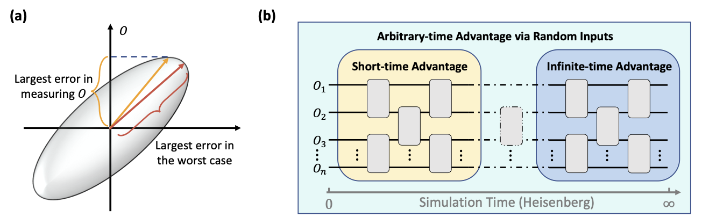
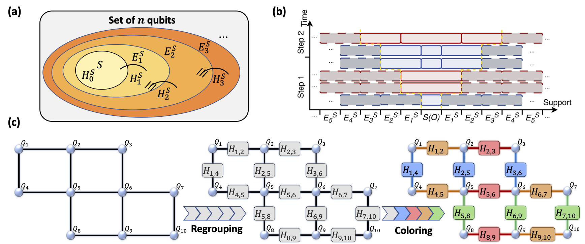
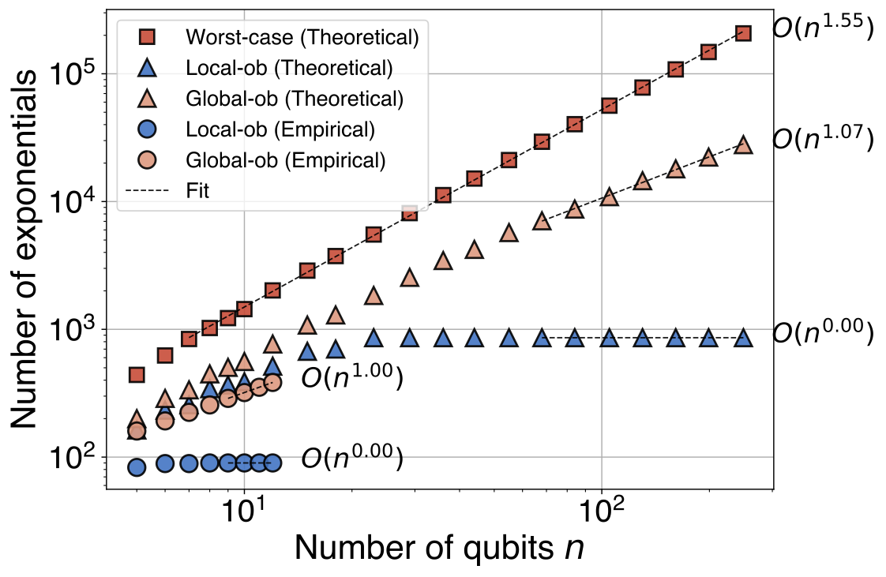
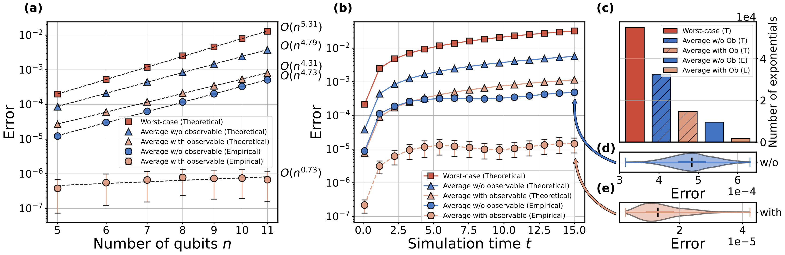

# Trotter-Error-with-Observable
[`Observable-Driven Speed-ups in Quantum Simulations`](https://arxiv.org/pdf/xxxx.pdf).
Wenjun Yu, Jue Xu and Qi Zhao, 2024

<!--  -->

## Short-time (light-cone)

### Single local observable and Sum of local observables
<!--  -->

More details in [short_time.ipynb](./code/short_time.ipynb) 

## Random-input (average-case error) with observables

More details in [random_input.ipynb](./code/random_input.ipynb) 

## Reference
- A Theory of Trotter Error, 
- 

## Usage 
`pip install ...`
### Requirements
- qiskit version == 
- openfermion
- python (version = 3.10), numpy, scipy, matplotlib, jax