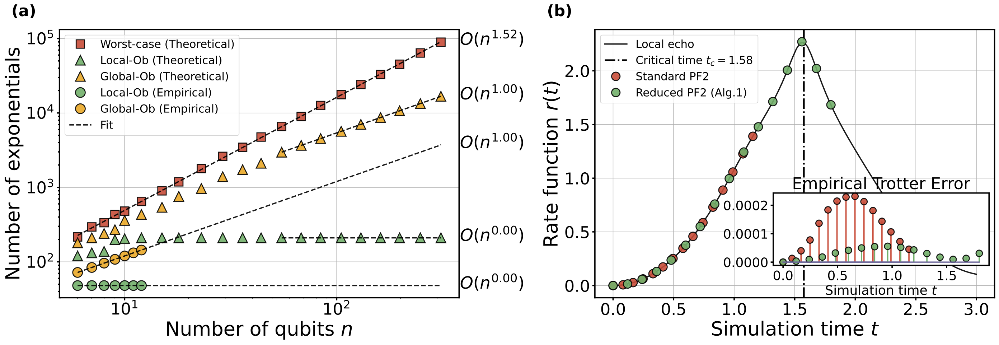
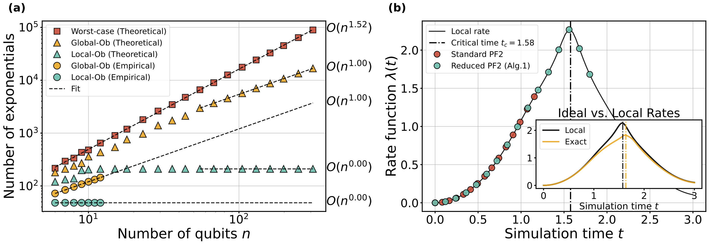

# Trotter-Error-with-Observable


<!--  -->
[`Observable-Driven Speed-ups in Quantum Simulations`](https://arxiv.org/pdf/xxxx.pdf).
Wenjun Yu, Jue Xu and Qi Zhao, 2024
[](https://arxiv.org/abs/xxxx)


## Short-time (light-cone)


### Single local observable, sum of local observables and DQPT
<!--  -->
<!--  -->


More details in [short_time.ipynb](./code/short_time.ipynb) and [dqpt_lightcone.ipynb](./code/dqpt_lightcone.ipynb)

## Random-input (average-case error) with observables

More details in [random_input.ipynb](./code/random_input.ipynb) 

## Main Reference
- A. M. Childs, Y. Su, M. C. Tran, N. Wiebe, and S. Zhu,
[Theory of trotter error with commutator scaling](https://arxiv.org/abs/1912.08854), Physical Review X 11, 011020 (2021).
- Q. Zhao, Y. Zhou, A. F. Shaw, T. Li, and A. M. Childs, 
[Hamiltonian simulation with random inputs](https://arxiv.org/abs/2111.04773), Physical Review Letters 129, 270502 (2022).

## Usage 
<!-- - Create python environment `conda create --name myenv python=3.10`
- Install requirements `pip install -r ./code/requirements.txt` -->
```
# Create python environment
conda create --name myenv python=3.10 

# Install requirements
pip install -r ./code/requirements.txt 
```

<!-- ### Requirements
- qiskit version == 
- openfermion
- python (version = 3.10), numpy, scipy, matplotlib, jax -->